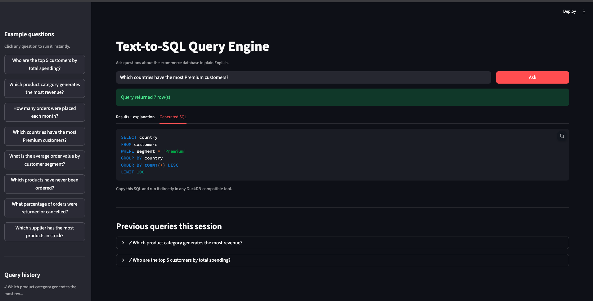

# AnomalyAI — Incident Investigation Console

> *Anomaly detection that tells you why, not just when.*

A forensic investigation console for industrial time-series data. Detects anomalies across correlated signals using three parallel statistical methods, reconstructs the causal chain using Granger causality and lag analysis, and generates a structured incident report in plain English — all running locally on Apple Silicon.



## What makes this different

Every monitoring tool detects anomalies. Almost none explain them. AnomalyAI goes beyond flagging a spike — it runs cross-signal correlation, lag analysis, and Granger causality tests to determine which signal deviated first and which signals caused which downstream effects. The result is a ranked root cause list with composite scores, an evidence timeline showing the causal chain, and an AI-written incident report with probable cause, contributing factors, and recommended actions.

## Four incident scenarios

| Scenario | Type | Root cause signal | Severity |
|---|---|---|---|
| Cooling system failure | Cascade | Temperature | Critical |
| Upstream pressure surge | Spike | Pressure | High |
| Bearing wear degradation | Drift | Vibration | Medium |
| Control system fault | Fault | Error rate | High |

Each scenario has 5 correlated signals: temperature, pressure, vibration, error_rate, throughput — with realistic cascading failure patterns injected at different lags.

## Architecture
mkdir -p assets
cat > README.md << 'ENDOFFILE'
# AnomalyAI — Incident Investigation Console

> *Anomaly detection that tells you why, not just when.*

A forensic investigation console for industrial time-series data. Detects anomalies across correlated signals using three parallel statistical methods, reconstructs the causal chain using Granger causality and lag analysis, and generates a structured incident report in plain English — all running locally on Apple Silicon.


## What makes this different

Every monitoring tool detects anomalies. Almost none explain them. AnomalyAI goes beyond flagging a spike — it runs cross-signal correlation, lag analysis, and Granger causality tests to determine which signal deviated first and which signals caused which downstream effects. The result is a ranked root cause list with composite scores, an evidence timeline showing the causal chain, and an AI-written incident report with probable cause, contributing factors, and recommended actions.

## Four incident scenarios

| Scenario | Type | Root cause signal | Severity |
|---|---|---|---|
| Cooling system failure | Cascade | Temperature | Critical |
| Upstream pressure surge | Spike | Pressure | High |
| Bearing wear degradation | Drift | Vibration | Medium |
| Control system fault | Fault | Error rate | High |

Each scenario has 5 correlated signals: temperature, pressure, vibration, error_rate, throughput — with realistic cascading failure patterns injected at different lags.

## Architecture
```
signals.py      — 4 synthetic industrial scenarios, 5 correlated signals each
detector.py     — triple-layer anomaly detection: Z-score + IQR + CUSUM
investigator.py — cross-correlation, lag analysis, Granger causality, evidence timeline
reporter.py     — Ollama LLM generates structured incident report
app.py          — forensic investigation console UI
```

## Detection methods

| Method | Detects | Threshold |
|---|---|---|
| Z-score | Spikes and point anomalies | σ > 3.0 |
| IQR | Robust outliers | 2.5 × IQR |
| CUSUM | Sustained drifts and level shifts | Cumulative sum > 5.0 |
| Granger causality | Causal signal direction | p < 0.05 |

## Root cause scoring

Each candidate signal receives a composite score from three components:

- **Lag score (40%)** — signals that deviate first score higher
- **Granger score (35%)** — signals with stronger causal influence on downstream signals score higher
- **Severity score (25%)** — signals with more extreme anomalies score higher

## Stack

- Python 3.11
- scipy — statistical tests, cross-correlation
- statsmodels — Granger causality tests
- NumPy / Pandas — signal generation and wrangling
- Plotly — multi-panel signal monitor, heatmap, root cause bars
- Streamlit — investigation console UI
- Ollama + llama3.2:3b — local LLM incident report generation

## Setup

### Prerequisites
- macOS Apple Silicon (M1/M2/M3)
- [Ollama](https://ollama.com) installed

### Install
```bash
git clone https://github.com/soganapawankalyan/anomaly-archaeology-engine.git
cd anomaly-archaeology-engine

python -m venv venv
source venv/bin/activate
pip install -r requirements.txt

ollama pull llama3.2:3b
```

### Run
```bash
python -m streamlit run app.py
```

Open `http://localhost:8501`, select an incident scenario, and click **Investigate incident**.

## Key design decisions

**Why three detection methods instead of one?** Z-score catches spikes but misses slow drifts. IQR is robust to outliers but misses sustained shifts. CUSUM catches cumulative deviations that neither point method sees. Running all three in parallel and taking the union gives near-complete anomaly coverage across all failure modes.

**Why Granger causality for root cause?** Correlation tells you two signals move together. Granger causality tests whether the history of signal A predicts the future of signal B — a directional test. This is what separates "these signals are related" from "this signal caused that one."

**Why a composite score instead of picking the first-detected signal?** First detection alone is unreliable — noise can trigger a false early detection on a non-causal signal. Weighting lag score, Granger score, and severity together produces a more robust and defensible root cause ranking.

## Interview talking points

- Built a triple-layer anomaly detection pipeline combining Z-score, IQR, and CUSUM — each catching different failure modes that the others miss
- Implemented Granger causality testing across all signal pairs to determine causal direction, not just correlation — directly applicable to root cause analysis in any operational domain
- Designed a composite root cause scoring system weighting temporal precedence, causal influence, and anomaly severity — produces defensible rankings rather than arbitrary first-detection guesses
- Applied this methodology directly to the same class of problems encountered during internship IoT sensor analytics work — elevated from manual analysis to an automated investigation pipeline
